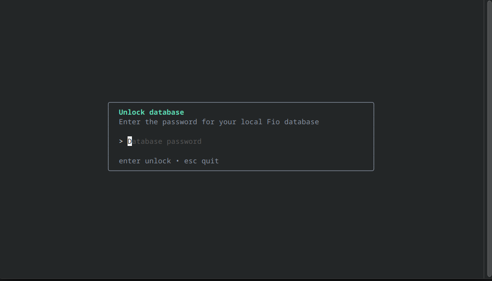
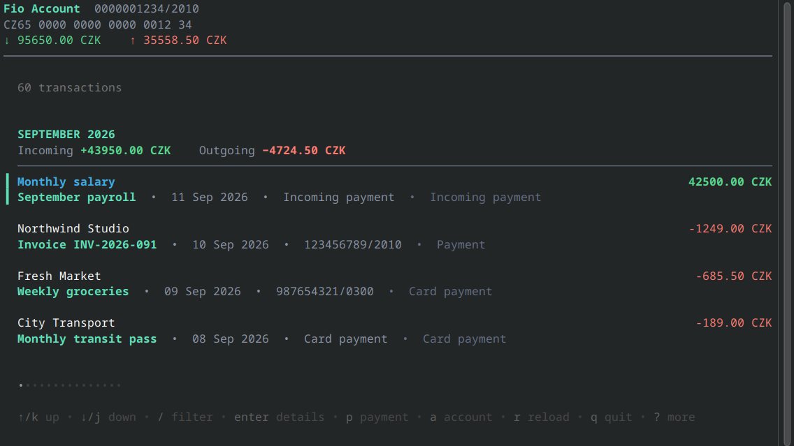
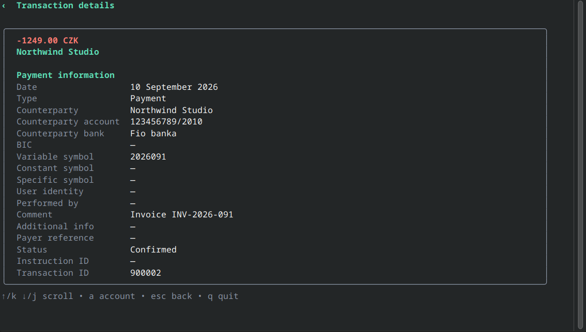
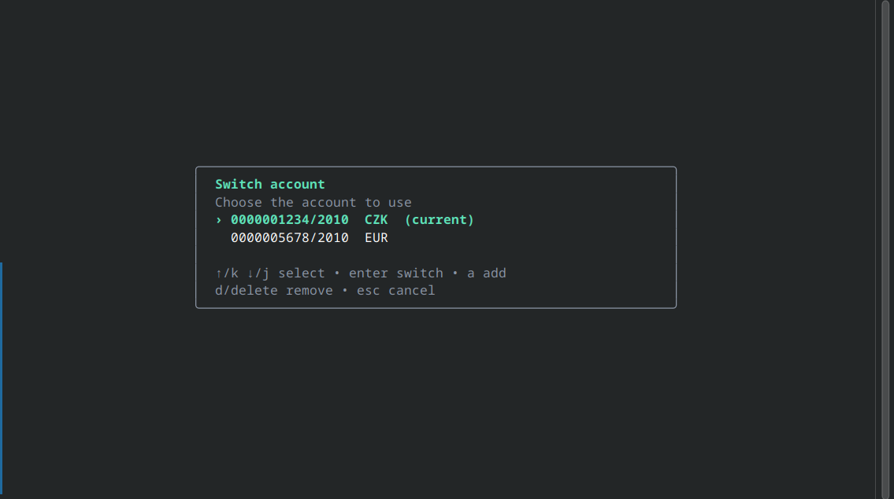
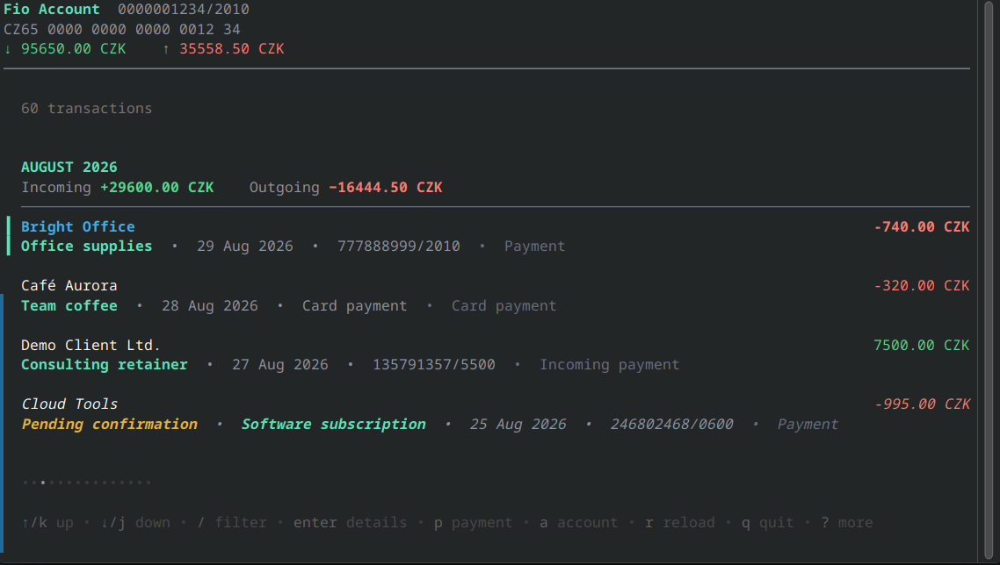
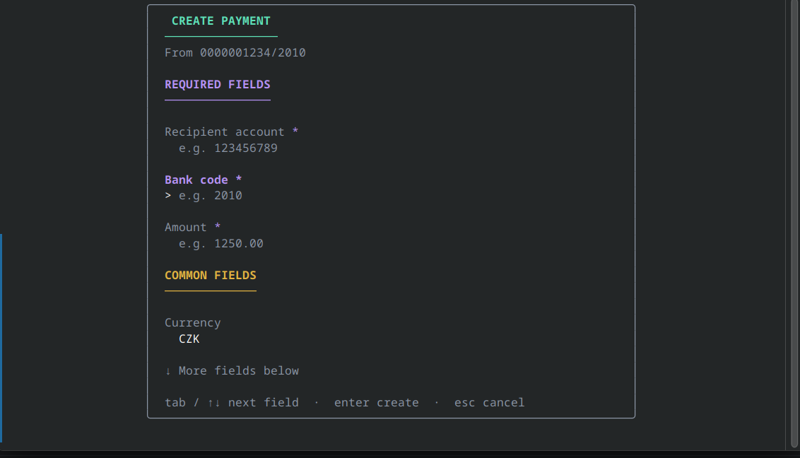

# Fio CLI

Fio CLI is a command-line client for managing Fio bank accounts. It stores account credentials and transaction data in a local encrypted database, lets you switch between configured accounts, synchronizes transactions, and can create domestic payments. An interactive terminal UI is available for browsing accounts and transactions.

## Requirements

- Go 1.27 or a development shell from `flake.nix`
- A Fio bank API key
- An encryption password, supplied through `FIO_ENCRYPTION_PASSWORD` or entered
  in the interactive UI

## Build and run

```sh
nix develop       # optional; provides the native build dependencies
make              # builds ./fio
FIO_ENCRYPTION_PASSWORD='your-password' ./fio accounts
```

The Linux binary is built for the host architecture and uses its standard
system dynamic loader rather than a Nix-store loader. For an unusual libc or
filesystem layout, provide its loader path explicitly, for example:
`make ELF_INTERPRETER=/custom/lib/ld-linux-aarch64.so.1`.

## Linux packages

Build a native package after entering the development shell:

```sh
nix develop
make deb  # writes out/fio-cli_<version>_<architecture>.deb
make rpm  # writes out/fio-cli-<version>-1.<architecture>.rpm
make appimage  # writes out/fio-cli_<version>_<architecture>.AppImage
```

Both targets build for the current system and build the binary first. Package
versions default to the current Git tag (or Git description) and can be overridden, for example:
`make deb VERSION=1.2.3`.

The default database is stored at the platform's user config directory under `fio-cli/fio-cli.db`. It can be changed with `--db`. Configuration is read from `$HOME/.fio.yaml` by default, and command-line flags can also be provided through `FIO_` environment variables.

## Common commands

```sh
FIO_ENCRYPTION_PASSWORD='your-password' ./fio add-account
./fio accounts
./fio transactions --sync
./fio transactions --json
./fio sync
./fio switch-account <account-number>
./fio ui
./fio create-payment <account>/<bank-code> <amount>
```

Run `./fio --help` or `./fio <command> --help` for all commands and flags. API keys are prompted for interactively when adding an account; avoid passing them directly on the command line where possible.

## Interactive UI

Start the terminal UI with `./fio ui`. If the encrypted database cannot be
opened with `FIO_ENCRYPTION_PASSWORD`, it prompts for the password instead. The
password input is masked.

The UI works even when no account has been configured: add an account by
entering its API key, then choose which account to use. It lets you browse and
filter transactions, inspect transaction details, synchronize new transactions,
switch or remove accounts, and create domestic payments. The payment form
collects recipient details, amount and currency, recipient message, payment
symbols, requested date, payment type, and a private comment. After a
successful submission, the local transaction list refreshes.

### Screenshots

<p>
  
  
</p>
<p>
  
  
</p>
<p>
  
  
</p>

From the transaction screen:

- `enter` opens the selected transaction's details.
- `p` opens the domestic-payment form.
- `a` opens the account picker, where `d`/`delete` removes an account.
- `r` synchronizes transactions; `/` filters the list; `q` or `Ctrl+C` quits.

Press `esc` to leave a form or dialog without submitting it. The UI includes
contextual key hints for its other controls.

## Development

```sh
GOCACHE=/tmp/fiocli-go-cache go test ./...
GOCACHE=/tmp/fiocli-go-cache go vet ./...
```
